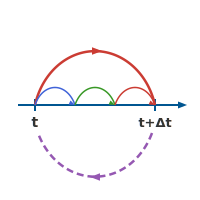

<div align="center">
  
</div>

# ClimaTimeSteppers.jl

High-performance ODE solvers for climate model time-stepping. Designed for
distributed and GPU computation with minimal memory footprint.

ClimaTimeSteppers.jl provides the time integration layer for
[ClimaAtmos.jl](https://github.com/CliMA/ClimaAtmos.jl),
[ClimaLand.jl](https://github.com/CliMA/ClimaLand.jl), and
[ClimaCoupler.jl](https://github.com/CliMA/ClimaCoupler.jl).

|                           |                                                                          |
|--------------------------:|:-------------------------------------------------------------------------|
| **Stable Release**        | [![stable][stable-img]][stable-url] [![docs-stable][docs-stable-img]][docs-stable-url] |
| **Unit Tests**            | [![unit tests][gha-ci-img]][gha-ci-url] [![codecov][codecov-img]][codecov-url] |
| **Downloads**             | [![Downloads][dlt-img]][dlt-url]                                         |

[stable-img]: https://img.shields.io/github/v/release/CliMA/ClimaTimeSteppers.jl?label=stable
[stable-url]: https://github.com/CliMA/ClimaTimeSteppers.jl/releases/latest

[docs-stable-img]: https://img.shields.io/badge/docs-stable-green.svg
[docs-stable-url]: https://CliMA.github.io/ClimaTimeSteppers.jl/stable/

[gha-ci-img]: https://github.com/CliMA/ClimaTimeSteppers.jl/actions/workflows/ci.yml/badge.svg
[gha-ci-url]: https://github.com/CliMA/ClimaTimeSteppers.jl/actions/workflows/ci.yml

[codecov-img]: https://codecov.io/gh/CliMA/ClimaTimeSteppers.jl/branch/main/graph/badge.svg
[codecov-url]: https://codecov.io/gh/CliMA/ClimaTimeSteppers.jl

[dlt-img]: https://img.shields.io/badge/dynamic/json?url=http%3A%2F%2Fjuliapkgstats.com%2Fapi%2Fv1%2Ftotal_downloads%2FClimaTimeSteppers&query=total_requests&label=Downloads
[dlt-url]: https://juliapkgstats.com/pkg/ClimaTimeSteppers

## Features

- **IMEX methods**: 30+ implicit-explicit additive Runge-Kutta tableaux (ARS, IMKG, SSP, ARK families) up to 5th order
- **SSP methods**: Strong stability preserving methods with built-in limiter support
- **Rosenbrock methods**: Linearly implicit — single linear solve per stage, no Newton iteration
- **Low-storage Runge-Kutta**: 2N-storage explicit methods (only two state-sized arrays)
- **Multirate methods**: MIS and Wicker-Skamarock schemes for separated timescales
- **Flexible Newton solver**: Krylov (GMRES), Jacobian-free Newton-Krylov (JFNK), configurable update strategies
- **AD compatible**: Propagates dual numbers and works with automatic differentiation packages (e.g., [ForwardDiff.jl](https://github.com/JuliaDiff/ForwardDiff.jl)) for gradient-based calibration
- **GPU ready**: Type-stable, allocation-free stepping kernels

## Quick Example

```julia
using ClimaTimeSteppers
import ClimaTimeSteppers as CTS

# Define du/dt = -u (exponential decay)
f = ClimaODEFunction(; T_exp! = (du, u, p, t) -> (du .= -u))
prob = CTS.ODEProblem(f, [1.0], (0.0, 5.0), nothing)

# Solve with an explicit RK4 algorithm
alg = ExplicitAlgorithm(RK4())
sol = CTS.solve(prob, alg; dt = 0.1)

# Or step manually
integrator = CTS.init(prob, alg; dt = 0.1)
CTS.step!(integrator)
CTS.solve!(integrator)
```

For IMEX problems (e.g., stiff vertical diffusion + explicit horizontal
advection), provide an implicit tendency with a Jacobian:

```julia
T_imp! = CTS.ODEFunction(T_imp!; jac_prototype = W, Wfact = Wfact!)
f = ClimaODEFunction(; T_exp!, T_imp!, dss!)
alg = IMEXAlgorithm(ARS343(), NewtonsMethod(; max_iters = 2))
```

See the [documentation](https://CliMA.github.io/ClimaTimeSteppers.jl/dev/)
for the full tutorial.

## Installation

ClimaTimeSteppers.jl is a registered Julia package:

```julia
using Pkg
Pkg.add("ClimaTimeSteppers")
```

## Contributing

See the [contributor guide](https://CliMA.github.io/ClimaTimeSteppers.jl/dev/contributing/) for information on contributing.

## Release Policy

ClimaTimeSteppers.jl is a core component of the CliMA ecosystem and can have
a significant impact on downstream packages. Before making a breaking release,
a stable patch release must be exercised by user repos (ClimaAtmos, ClimaLand,
ClimaCoupler) without new issues.

## Related Packages

ClimaTimeSteppers.jl is part of the [CliMA](https://github.com/CliMA) ecosystem:

- [ClimaAtmos.jl](https://github.com/CliMA/ClimaAtmos.jl) — Atmospheric model
- [ClimaLand.jl](https://github.com/CliMA/ClimaLand.jl) — Land surface model
- [ClimaCoupler.jl](https://github.com/CliMA/ClimaCoupler.jl) — Model coupler
- [ClimaCore.jl](https://github.com/CliMA/ClimaCore.jl) — Spectral element spatial discretization
- [ClimaComms.jl](https://github.com/CliMA/ClimaComms.jl) — Distributed and GPU communication

