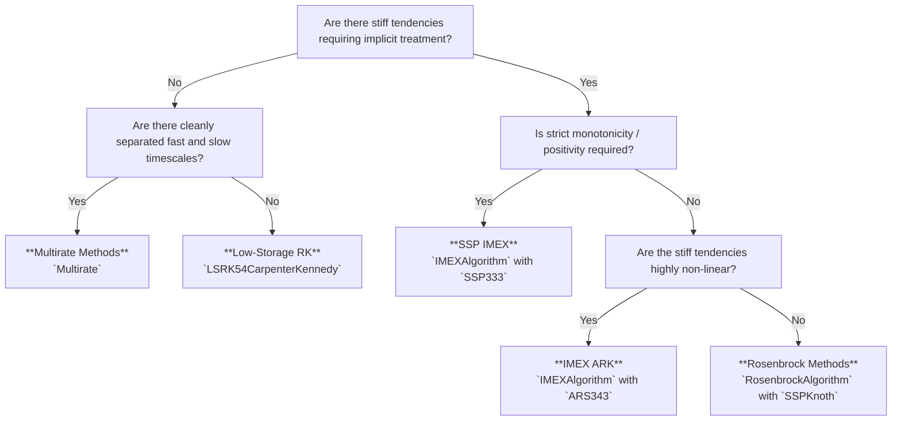

# Algorithm Comparisons

```@meta
CurrentModule = ClimaTimeSteppers
```

ClimaTimeSteppers.jl provides several distinct families of time-stepping algorithms, each tailored to specific physical regimes, computational trade-offs, and memory constraints found in climate and weather modeling.

This page summarizes the comparative strengths, storage requirements, and use cases for each algorithm family to help modelers choose the most efficient solver for their specific partial differential equation (PDE) system.

## Summary Comparison Table

| Algorithm Family | Main Type | Storage Needed | Nonlinear Solver? | Linear Solve Type | Limiter Support | Ideal Problem Profile |
| :--- | :--- | :--- | :--- | :--- | :--- | :--- |
| **IMEX ARK** | [`IMEXAlgorithm`](@ref) | ``(2s_{\text{exp}} + s_{\text{imp}} + 4) N`` | Yes (Newton's method) | Exact or Krylov (GMRES/JFNK) | Manual / Unconstrained | Non-linear stiff tendencies (e.g., vertical diffusion, microphysics) coupled with explicit advection. |
| **SSP IMEX** | [`IMEXAlgorithm`](@ref) | ``(s_{\text{imp}} + 8) N`` | Yes (Newton's method) | Exact or Krylov (GMRES/JFNK) | **Yes (Mathematically consistent)** | Transport of positive-definite tracers (moisture, aerosols) requiring strict monotonicity. |
| **Rosenbrock** | [`RosenbrockAlgorithm`](@ref) | ``(s + 6) N`` | No | Single linear solve per stage | Manual / Unconstrained | Linearly stiff systems where Jacobian updates and linear solves are inexpensive. |
| **Low-Storage RK** | [`LowStorageRungeKutta2N`](@ref) | ``2N`` | No | None (Purely explicit) | Manual / Unconstrained | Memory-bound, non-stiff 3D explicit dynamics (e.g., high-resolution advection). |
| **Multirate** | [`Multirate`](@ref) | ``(2s_{\text{outer}} + 2) N`` | No (in explicit mode) | None (in explicit mode) | Outer/Inner dependent | Systems with cleanly separated fast/slow timescales (e.g., acoustic waves vs. advection). |

*(Note: ``N`` represents the size of the state vector ``u``. ``s_{\text{exp}}`` and ``s_{\text{imp}}`` represent the number of explicit and implicit stages in the Butcher tableau. Storage formulas reflect the total state-sized vector allocations across the integrator and cache, as verified in `test/unit/cache_sizes.jl`).*

---

## Detailed Algorithm Profiles

### 1. IMEX Additive Runge-Kutta (ARK)
* **Constructor**: `IMEXAlgorithm(ARS343(), NewtonsMethod(...))`
* **Overview**: Splits the governing equations into a non-stiff explicit tendency (``T_{\text{exp}}``) and a stiff implicit tendency (``T_{\text{imp}}``). Each stage involves solving an implicit equation of the form ``U = U_0 + \Delta t \gamma T_{\text{imp}}(U)``.
* **Strengths**: Highly flexible. Because it couples with [`NewtonsMethod`](@ref), it can handle severely non-linear stiff processes (such as cloud microphysics or soil hydrology). It supports Jacobian-free Newton-Krylov (JFNK) and GMRES solvers, allowing matrix-free implicit solves.
* **Trade-offs**: Requires storing intermediate stage tendencies and state copies, resulting in a larger memory footprint. Solving non-linear equations via Newton iterations can be computationally expensive if multiple iterations are required per stage.

### 2. Strong Stability Preserving (SSP) IMEX
* **Constructor**: `IMEXAlgorithm(SSP333(), NewtonsMethod(...), SSP())`
* **Overview**: A specialized class of IMEX methods where the explicit stages are constructed as convex combinations of forward Euler steps.
* **Strengths**: **Monotonicity preservation**. Standard Runge-Kutta methods can generate spurious oscillations (overshoots and undershoots) near sharp gradients, which can cause unphysical negative concentrations in water vapor or tracers. The [`SSP`](@ref) constraint ensures that if the forward Euler step is monotonic, the full multi-stage method remains monotonic. This makes the application of non-linear limiters (`lim!`) mathematically consistent.
* **Trade-offs**: Requires additional cache arrays to store un-limited and limited state increments (`U_exp`, `U_lim`). SSP Butcher tableaux generally have slightly higher error coefficients than unconstrained tableaux of the same order.

### 3. Rosenbrock Methods
* **Constructor**: `RosenbrockAlgorithm(tableau(SSPKnoth()))`
* **Overview**: Linearly implicit methods that replace the non-linear Newton iteration of IMEX ARK with a single linear solve per stage, directly utilizing the Jacobian ``J = \frac{\partial T_{\text{imp}}}{\partial u}``.
* **Strengths**: **Computational efficiency for linear stiffness**. Because there is no non-linear iteration, Rosenbrock methods require exactly one linear solve per stage. If the stiff tendencies are linear or mildly non-linear, Rosenbrock methods achieve the stability of fully implicit methods at a fraction of the computational cost.
* **Trade-offs**: Requires an explicit Jacobian operator (`Wfact`) and does not currently support matrix-free JFNK. If the physical process is highly non-linear, a single linear step may not fully capture the dynamics without restricting the timestep.

### 4. Low-Storage Explicit Runge-Kutta (LSRK)
* **Constructor**: `LSRK54CarpenterKennedy()` / `LSRK144NiegemannDiehlBusch()`
* **Overview**: Explicit Runge-Kutta methods specifically transformed to operate using only two state-sized arrays in memory (the ``2N`` storage format), requiring an [`IncrementingODEFunction`](@ref).
* **Strengths**: **Minimal memory footprint**. In high-resolution 3D atmospheric or oceanic simulations, memory bandwidth and capacity are often the primary bottlenecks. LSRK methods drastically reduce memory pressure and cache misses compared to standard explicit RK methods (which require ``(s+1)N`` storage).
* **Trade-offs**: Purely explicit, meaning the maximum stable timestep is strictly governed by the Courant-Friedrichs-Lewy (CFL) condition of the fastest wave in the system.

### 5. Multirate Methods
* **Constructor**: `Multirate(LSRK54CarpenterKennedy(), MIS3C())`
* **Overview**: Integrates systems with separated fast and slow timescales by pairing an outer "slow" solver (e.g., Multirate Infinitesimal Step, MIS) with an inner "fast" solver (e.g., LSRK). The slow tendencies are evaluated at the outer timestep ``\Delta t`` and held constant as forcing terms while the fast tendencies are sub-stepped at ``\Delta t_{\text{fast}}``.
* **Strengths**: **Bypasses acoustic/gravity wave CFL restrictions explicitly**. In atmospheric dynamics, acoustic waves travel much faster than advective winds but carry little energy. Multirate methods sub-step the acoustic modes cheaply while evaluating the expensive advection/physics tendencies only at the large outer timestep, entirely avoiding the need for complex implicit linear solvers.
* **Trade-offs**: Requires decomposing the problem into a `SplitODEProblem`. Care must be taken to ensure stability at the interface between fast and slow modes.

---

## Practical Selection Guide

Use the following decision tree to determine the best algorithm family for your simulation:


